# Testreports
Testing was done using the testing framework vitest. All tests can be found in the directory ./tests.

## Reports

### Tests run 2024-10-01:

Analogous test report:
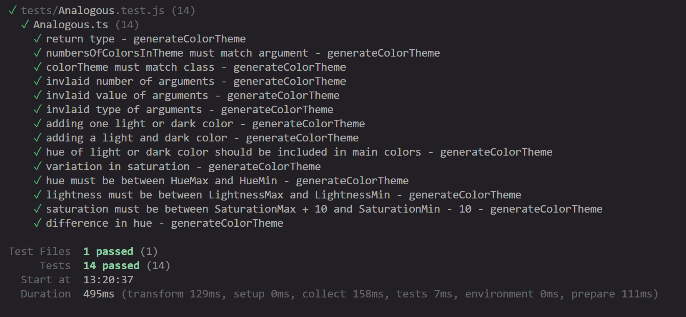

Calculator test report:
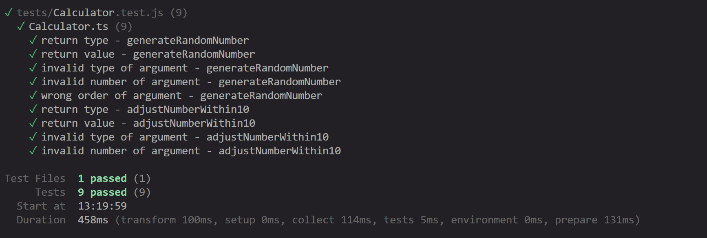

Color test report:
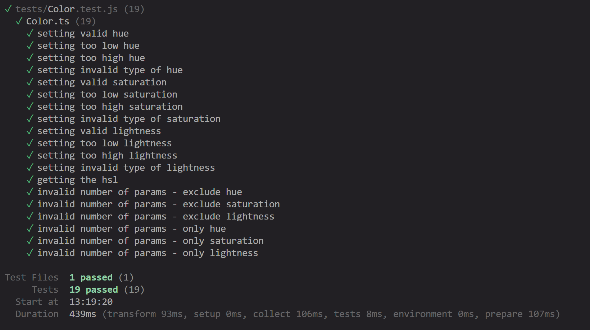

ColorThemeData test report:
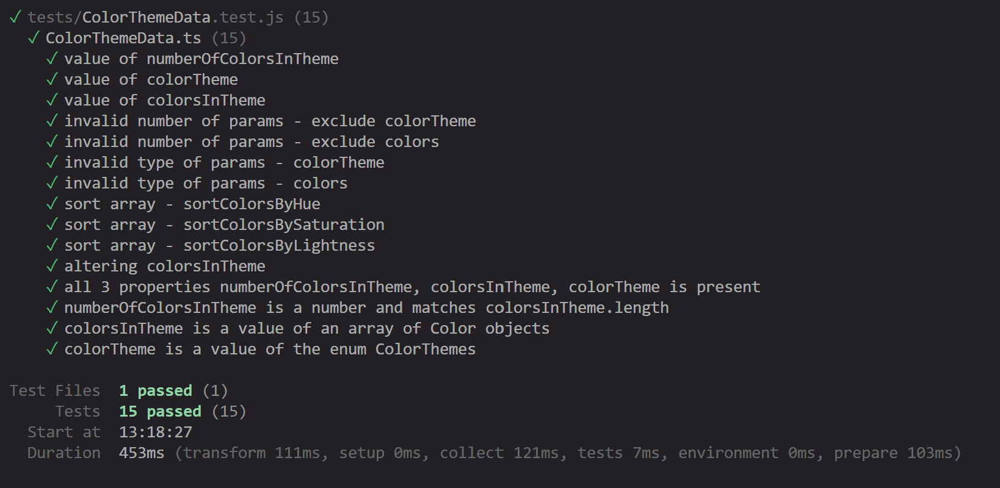

Complementary test report:
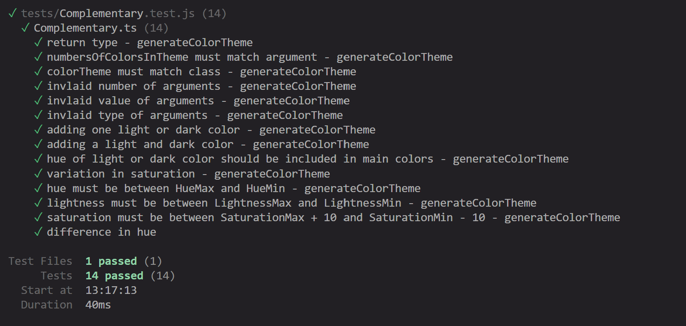

CSSColorSetter test report:
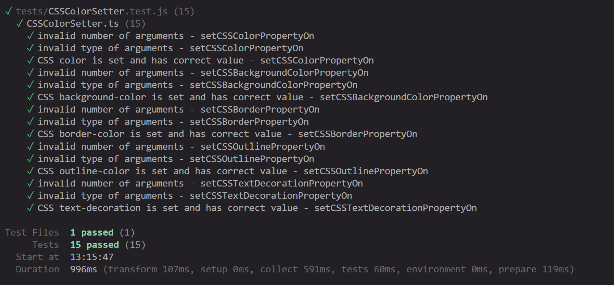

Guard test report:
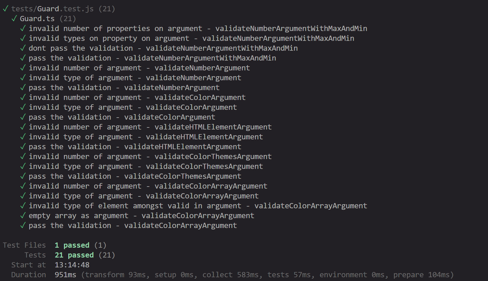

HTMLColorSwatch test report:

Monochrome test report:
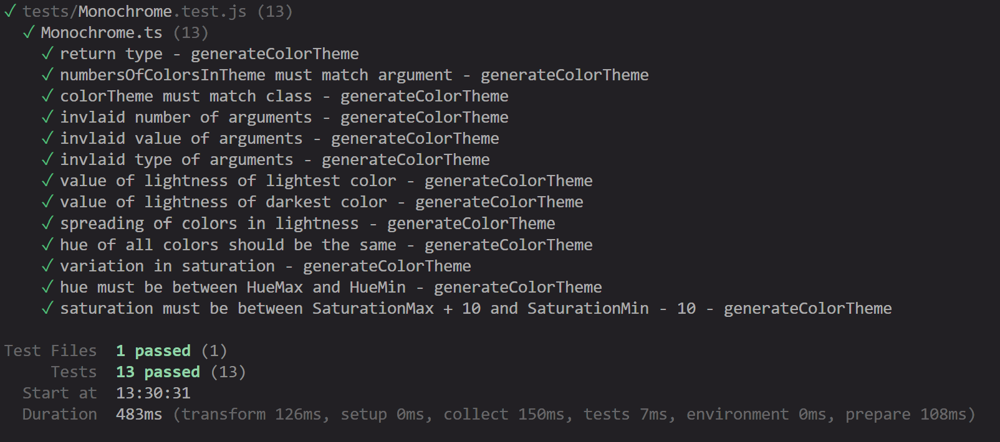

RandomColorTheme test report:
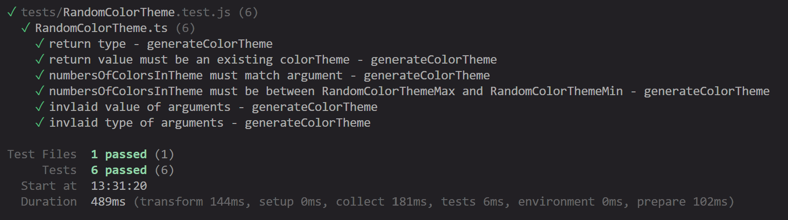

SplitComplementary test report:
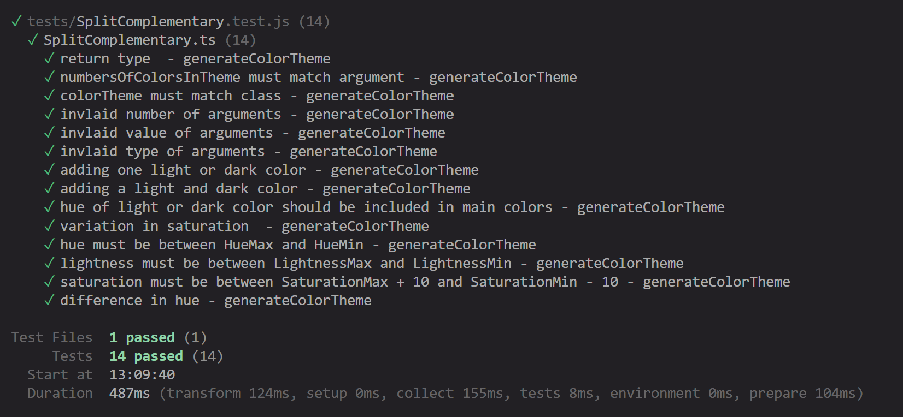

Triadic test report:
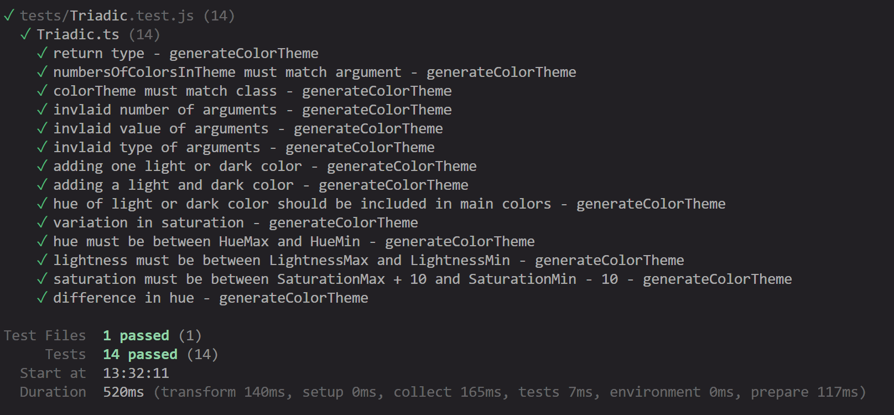

Coverage test report:
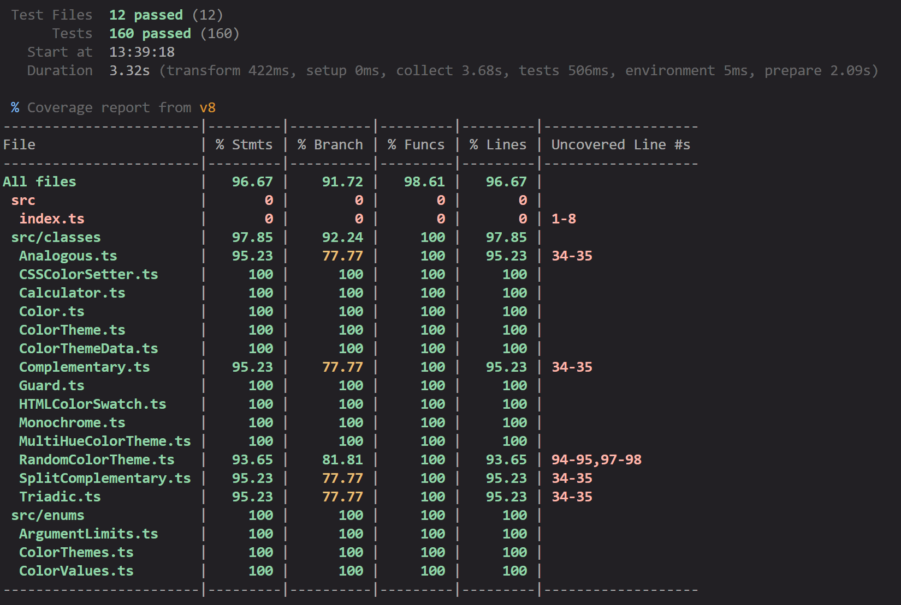